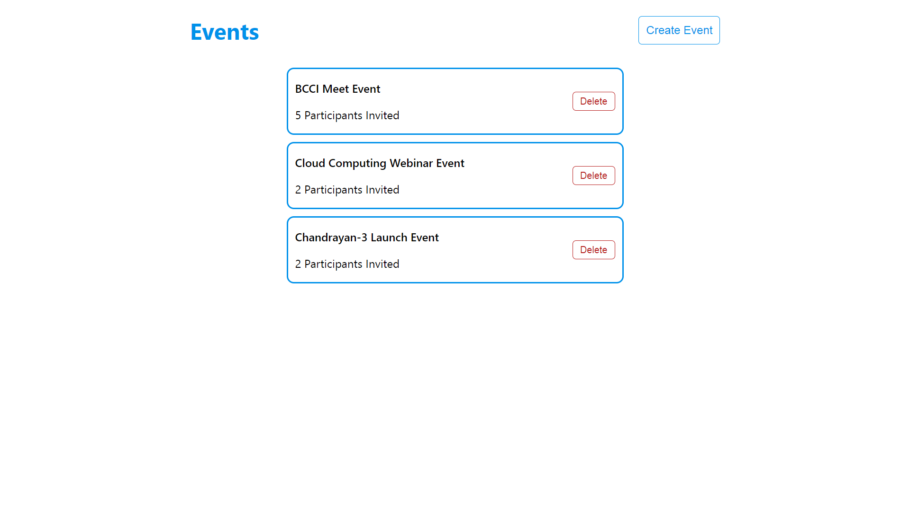
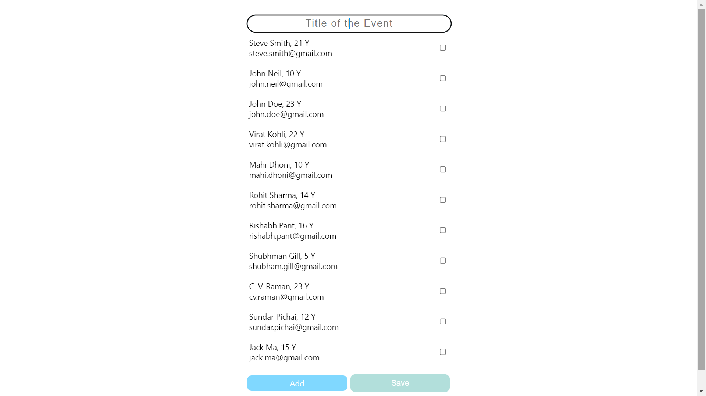
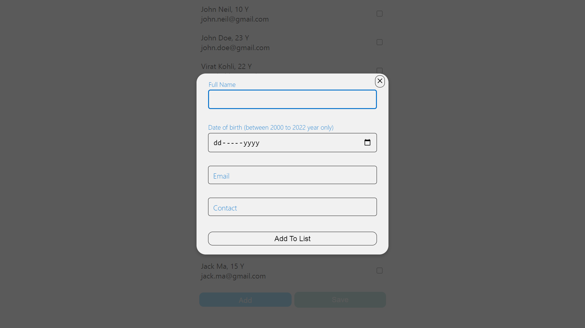

# Event_Management_MERN_Stack_Application.

### It is MERN Stack Event App in which user can create a event and managing invites for the participants.

## The deploy link is here
* FrontEnd `https://neuro-spark-create-event-mern-app.vercel.app/`
* BackEnd `https://create-event-mern-stack-app.vercel.app`

## Frontend
- React JS
- Redux
- HTML
- CSS
- JavaScript

## Used Libraries
- node modules
- styled-components
- axios
- react-router-dom
- react-icons

## Backend
- Node JS
- Express JS
- MongoDB
- Mongoose

## Features
- See all event on home page
- Create Event
- Add Participants
- Select Participants
- Delete Event

## Some screenshots of the project

1. Event Home Page

2. Create Event Page

3. Add Participant Page

## Thank you reading
